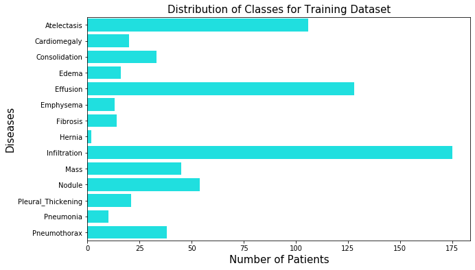
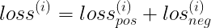
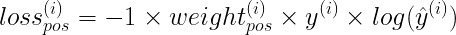
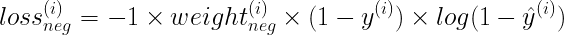

# Data Exploration & Handling Challenges of Medical Image Data

In this resository we will discuss the following things step-by-step:
- [Data Exploration of **ChestX-ray8** dataset](https://nbviewer.jupyter.org/github/kampaitees/Medical-Data-Exploration-Handling-Challenges/blob/main/ChestX-ray8%20Data%20Exploration.ipynb)
- [Handling **Data Imbalance** within classes of a dataset](https://nbviewer.jupyter.org/github/kampaitees/Medical-Data-Exploration-Handling-Challenges/blob/main/Handling%20Data%20Imbalance%20using%20Weighted%20Loss%20Function.ipynb)
- [Creating pipeline for training **Densenet** on Medical Data](https://nbviewer.jupyter.org/github/kampaitees/Medical-Data-Exploration-Handling-Challenges/blob/main/Pipeline%20for%20training%20Densenet.ipynb)
- [**Handling Patient Overlap**(**Data Leakage**) problem in dataset](https://nbviewer.jupyter.org/github/kampaitees/Medical-Data-Exploration-Handling-Challenges/blob/main/Handling%20Patient%20Overlap%20%26%20Data%20Leakage.ipynb)
 

## Data Exploration of ChestX-ray8 dataset 

**While doing data exploration, we have to follow certain steps which I am going to discuss below:**

1) We have to load the dataset and have a look at it

2) We have to check what are different categories of data types are there in the dataset such as: categorical, continous, etc...

3) As we have seen the data, now we have to remove the useless data which won't help in exploration such as patient_id, image_url etc..

4) We alos have to check whehter there is duplcate entries are there in the dataset, if it's there then remove it.

5) Data Visualization - exploring the images it's histogram. It's important to see the distribution of image because most of the ML algo works best at 0 **Mean** and unit **Standard deviation**. To **Standardize** the dataset we can use **ImageDataGenerator** from **Keras**.

**We have seen the steps which are requrired to follow in data exploration of dataset, now let's do them step-by-step.**

#### Importing necessary packages
    import pandas as pd
    import numpy as np
    import matplotlib.pyplot as plt
    %matplotlib inline
    import os
    import seaborn as sns
    sns.set()

#### Reading csv file containing training datadata
    train_df = pd.read_csv("nih/train-small.csv")
#### Printing first 5 rows
    print(f'There are {train_df.shape[0]} rows and {train_df.shape[1]} columns in this data frame')
    train_df.head()
 

 

## Data types and null values check

#### Look at the data type of each column and whether null values are present
    train_df.info()

    Output:
    <class 'pandas.core.frame.DataFrame'>
    RangeIndex: 1000 entries, 0 to 999
    Data columns (total 16 columns):
    Image                 1000 non-null object
    Atelectasis           1000 non-null int64
    Cardiomegaly          1000 non-null int64
    Consolidation         1000 non-null int64
    Edema                 1000 non-null int64
    Effusion              1000 non-null int64
    Emphysema             1000 non-null int64
    Fibrosis              1000 non-null int64
    Hernia                1000 non-null int64
    Infiltration          1000 non-null int64
    Mass                  1000 non-null int64
    Nodule                1000 non-null int64
    PatientId             1000 non-null int64
    Pleural_Thickening    1000 non-null int64
    Pneumonia             1000 non-null int64
    Pneumothorax          1000 non-null int64
    dtypes: int64(15), object(1)
    memory usage: 125.1+ KB

### Unique IDs check

***PatientId* has an identification number for each patient. One thing we'd like to know about a medical dataset like this is if we're looking at repeated data for certain patients or whether each image represents a different person.**

    print(f"The total patient ids are {train_df['PatientId'].count()}, from those the unique ids are {train_df['PatientId'].value_counts().shape[0]}")

    Ouput :
    The total patient ids are 1000, from those the unique ids are 928 

**As we can see, the number of unique patients in the dataset is less than the total number so there must be some overlap. For patients with multiple records, we'll want to make sure they do not show up in both training and test sets in order to avoid data leakage.**

### Exploring data labels

#### Running the next two code cells to create a list of the names of each patient condition or disease.

    columns = train_df.keys()
    columns = list(columns)
    print(columns)

    Output:
    ['Image', 'Atelectasis', 'Cardiomegaly', 'Consolidation', 'Edema', 'Effusion', 'Emphysema', 'Fibrosis', 'Hernia', 'Infiltration', 'Mass', 'Nodule', 'PatientId', 'Pleural_Thickening', 'Pneumonia', 'Pneumothorax']

#### Removing unnecesary elements
    columns.remove('Image')
    columns.remove('PatientId')
#### Getting the total classes
    print(f"There are {len(columns)} columns of labels for these conditions: {columns}")

    Output:
    There are 14 columns of labels for these conditions: ['Atelectasis', 'Cardiomegaly', 'Consolidation', 'Edema', 'Effusion', 'Emphysema', 'Fibrosis', 'Hernia', 'Infiltration', 'Mass', 'Nodule', 'Pleural_Thickening', 'Pneumonia', 'Pneumothorax']

#### Printing out the number of positive labels for each class
    for column in columns:
        print(f"The class {column} has {train_df[column].sum()} samples")

    Output:

    The class Atelectasis has 106 samples
    The class Cardiomegaly has 20 samples
    The class Consolidation has 33 samples
    The class Edema has 16 samples
    The class Effusion has 128 samples
    The class Emphysema has 13 samples
    The class Fibrosis has 14 samples
    The class Hernia has 2 samples
    The class Infiltration has 175 samples
    The class Mass has 45 samples
    The class Nodule has 54 samples
    The class Pleural_Thickening has 21 samples
    The class Pneumonia has 10 samples
    The class Pneumothorax has 38 samples
 
**Have a look at the counts for the labels in each class above. Does this look like a balanced dataset?**
 
**No because the samples are not uniform in the dataset.**

### Data Visualization

#### Extracting numpy values from Image column in data frame
    images = train_df['Image'].values

#### Extracting 9 random images from it
    random_images = [np.random.choice(images) for i in range(9)]

#### Location of the image dir
    img_dir = 'nih/images-small/'
 
    print('Display Random Images')

#### Adjusting the size of our images
    plt.figure(figsize=(20,10))

#### Iterating and plotting random images
    for i in range(9):
        plt.subplot(3, 3, i + 1)
        img = plt.imread(os.path.join(img_dir, random_images[i]))
        plt.imshow(img, cmap='gray')
        plt.axis('off')
    
#### Adjustting subplot parameters to give specified padding
    plt.tight_layout()   
 

### Investigating a single image

#### Getting the first image that was listed in the train_df dataframe
    sample_img = train_df.Image[0]
    raw_image = plt.imread(os.path.join(img_dir, sample_img))
    plt.imshow(raw_image, cmap='gray')
    plt.colorbar()
    plt.title('Raw Chest X Ray Image')
    print(f"The dimensions of the image are {raw_image.shape[0]} pixels width and {raw_image.shape[1]} pixels height, one single color channel")
    print(f"The maximum pixel value is {raw_image.max():.4f} and the minimum is {raw_image.min():.4f}")
    print(f"The mean value of the pixels is {raw_image.mean():.4f} and the standard deviation is {raw_image.std():.4f}")

 

### Investigating pixel value distribution

#### Plotting a histogram of the distribution of the pixels
    sns.distplot(raw_image.ravel(), 
                label=f'Pixel Mean {np.mean(raw_image):.4f} & Standard Deviation {np.std(raw_image):.4f}', kde=False)
    plt.legend(loc='upper center')
    plt.title('Distribution of Pixel Intensities in the Image')
    plt.xlabel('Pixel Intensity')
    plt.ylabel('# Pixels in Image')
 

### Image Preprocessing in Keras

**Before training, we'll first modify our images to be better suited for training a convolutional neural network. For this task we'll use the Keras ImageDataGenerator function to perform data preprocessing and data augmentation.**
 

#### Importing data generator from keras
    from keras.preprocessing.image import ImageDataGenerator
    
    Output:
    Using TensorFlow backend.

#### Normalizing images
    image_generator = ImageDataGenerator(
        samplewise_center=True, #Set each sample mean to 0.
        samplewise_std_normalization= True # Divide each input by its standard deviation
    )

### Standardizationing pixel values
**The image_generator we created above will act to adjust our image data such that the new mean of the data will be zero, and the standard deviation of the data will be 1.**
 
**In other words, the generator will replace each pixel value in the image with a new value calculated by subtracting the mean and dividing by the standard deviation.**

 

### Pre-processing our data using the image_generator. 

**In this step we will also be reducing the image size down to 320x320 pixels.**
 

#### Flow from directory with specified batch size and target image size
    generator = image_generator.flow_from_dataframe(
            dataframe=train_df,
            directory="nih/images-small/",
            x_col="Image", # features
            y_col= ['Mass'], # labels
            class_mode="raw", # 'Mass' column should be in train_df
            batch_size= 1, # images per batch
            shuffle=False, # shuffle the rows or not
            target_size=(320,320) # width and height of output image
    )

    Output:
    Found 1000 validated image filenames.

#### Plot a processed image

    sns.set_style("white")
    generated_image, label = generator.__getitem__(0)
    plt.imshow(generated_image[0], cmap='gray')
    plt.colorbar()
    plt.title('Raw Chest X Ray Image')
    print(f"The dimensions of the image are {generated_image.shape[1]} pixels width and {generated_image.shape[2]} pixels height")
    print(f"The maximum pixel value is {generated_image.max():.4f} and the minimum is {generated_image.min():.4f}")
    print(f"The mean value of the pixels is {generated_image.mean():.4f} and the standard deviation is {generated_image.std():.4f}")
 

### Seeing a comparison of the distribution of pixel values in the new pre-processed image versus the raw imagez

#### Including a histogram of the distribution of the pixels
    sns.set()
    plt.figure(figsize=(10, 7))

#### Plotting histogram for original iamge
    sns.distplot(raw_image.ravel(), 
                label=f'Original Image: mean {np.mean(raw_image):.4f} - Standard Deviation {np.std(raw_image):.4f} \n '
                f'Min pixel value {np.min(raw_image):.4} - Max pixel value {np.max(raw_image):.4}',
                color='blue', 
                kde=False)

#### Plotting histogram for generated image
    sns.distplot(generated_image[0].ravel(), 
                label=f'Generated Image: mean {np.mean(generated_image[0]):.4f} - Standard Deviation {np.std(generated_image[0]):.4f} \n'
                f'Min pixel value {np.min(generated_image[0]):.4} - Max pixel value {np.max(generated_image[0]):.4}', 
                color='red', 
                kde=False)

#### Placing legends
    plt.legend()
    plt.title('Distribution of Pixel Intensities in the Image')
    plt.xlabel('Pixel Intensity')
    plt.ylabel('# Pixel')
 

 

### Handling Data Imbalance using Weighted Loss Function

**We know that in real-world especially in *Medical* field there is high imbalance in the dataset. As we know that most of the people are physically fit only a few have disease it is very difficult to have the medical data in large amount. Always the data having label as *normal* is more as compared to *abnormal* in *Medical* data. So it is very important to know how to deal with such situtation. In further conversation we wil discuss of how to deal with it.**

#### Counting up the number of instances of each class
    class_counts = train_df.sum().drop(['Image','PatientId'])
    for column in class_counts.keys():
        print(f"The class {column} has {train_df[column].sum()} samples")

    Output:
    The class Atelectasis has 106 samples
    The class Cardiomegaly has 20 samples
    The class Consolidation has 33 samples
    The class Edema has 16 samples
    The class Effusion has 128 samples
    The class Emphysema has 13 samples
    The class Fibrosis has 14 samples
    The class Hernia has 2 samples
    The class Infiltration has 175 samples
    The class Mass has 45 samples
    The class Nodule has 54 samples
    The class Pleural_Thickening has 21 samples
    The class Pneumonia has 10 samples
    The class Pneumothorax has 38 samples

#### Plotting up the distribution of counts
    plt.figure(figsize=(10, 6))
    sns.barplot(class_counts.values, class_counts.index, color='cyan')
    plt.title('Distribution of Classes for Training Dataset', fontsize=15)
    plt.xlabel('Number of Patients', fontsize=15)
    plt.ylabel('Diseases', fontsize=15)
    plt.show()

 

**From the plot above we can see that there is high imbalance between the classes.**

**Now we will see what happens if we don't do anything and use the same *Loss Function* for training.**

**Creating a demo dataset, containing 4 labels out of which 3 are *1* and one is *1*. Now consider 2 models, one always predicts 0.9 as probability of label 1 and other alsways predicts 0.1 as probability of label 1. Theoretically, loss calculated should be same because both are bad models.**

### Creating the 'ground truth' labels
    y_true = np.array(
        [[1],
         [1],
         [1],
         [0]])
    print(f"y_true: \n{y_true}")
    
    Output:
    y_true: 
    [[1]
    [1]
    [1]
    [0]]

### Two models

**To better understand the loss function, we will pretend that we have two models.**
- Model 1 always outputs a 0.9 for any example that it's given.
- Model 2 always outputs a 0.1 for any example that it's given.

#### Make model predictions that are always 0.9 for all examples
    y_pred_1 = 0.9 * np.ones(y_true.shape)
    print(f"y_pred_1: \n{y_pred_1}")
    print()
    y_pred_2 = 0.1 * np.ones(y_true.shape)
    print(f"y_pred_2: \n{y_pred_2}")

    Output:
    y_pred_1: 
    [[0.9]
    [0.9]
    [0.9]
    [0.9]]

    y_pred_2: 
    [[0.1]
    [0.1]
    [0.1]
    [0.1]]

### Let's calculate the loss for  both the models

#### Calcualting loss for model 1
    
    loss_reg_1 = -1 * np.sum(y_true * np.log(y_pred_1)) + -1 * np.sum((1 - y_true) * np.log(1 - y_pred_1))
    print(f"loss_reg_1: {loss_reg_1:.4f}")

    Output:
    loss_reg_1: 2.6187

    loss_reg_2 = -1 * np.sum(y_true * np.log(y_pred_2)) + -1 * np.sum((1 - y_true) * np.log(1 - y_pred_2))
    print(f"loss_reg_2: {loss_reg_2:.4f}")
    
    Output:
    loss_reg_2: 7.0131

    print(f"When the model 1 always predicts 0.9, the regular loss is {loss_reg_1:.4f}")
    print(f"When the model 2 always predicts 0.1, the regular loss is {loss_reg_2:.4f}")
    
    Output:
    When the model 1 always predicts 0.9, the regular loss is 2.6187
    When the model 2 always predicts 0.1, the regular loss is 7.0131

**Notice that the loss function gives a greater loss when the predictions are always 0.1, because the data is imbalanced, and has three labels of 1 but only one label for 0.**

**Given a class imbalance with more positive labels, the regular loss function implies that the model with the higher prediction of 0.9 performs better than the model with the lower prediction of 0.1 Which is not the case as both models are equally bad.**

### How a weighted loss treats both models the same

**With a weighted loss function, we will get the same weighted loss when the predictions are all 0.9 versus when the predictions are all 0.1.**

- Notice how a prediction of 0.9 is 0.1 away from the positive label of 1.
- Also notice how a prediction of 0.1 is 0.1 away from the negative label of 0.
- So model 1 and 2 are symmetric along the midpoint of 0.5, if we plot them on a number line between 0 and 1.

### Weighted Loss Equation

**Calculate the loss for the zero-th label**
 
**The loss is made up of two terms. To make it easier to read the code, we will calculate each of these terms separately. We are giving each of these two terms a name for explanatory purposes, but these are not officially called *losspos* or *lossneg***

- *losspos*: we'll use this to refer to the loss where the actual label is positive (the positive examples).
- *lossneg*: we'll use this to refer to the loss where the actual label is negative (the negative examples).

**Since this sample dataset is small enough, we can calculate the positive weight to be used in the weighted loss function. To get the positive weight, count how many NEGATIVE labels are present, divided by the total number of examples.**

**In this case, there is one negative label, and four total example. Similarly, the negative weight is the fraction of positive labels.**

### Defining positive and negative weights

#### calculate the positive weight as the fraction of negative labels
    w_p = 1/4
 
#### calculate the negative weight as the fraction of positive labels
    w_n = 3/4
    
    print(f"positive weight w_p: {w_p}")
    print(f"negative weight w_n {w_n}")

    Output:
    positive weight w_p: 0.25
    negative weight w_n 0.75

### Model 1 weighted loss

**Here, loss_1_pos and loss_1_neg are calculated using the y_pred_1 predictions.**

#### Calculating and printing out the first term in the loss function, which we are calling 'loss_pos'
    loss_1_pos = -1 * np.sum(w_p * y_true * np.log(y_pred_1 ))
    print(f"loss_1_pos: {loss_1_pos:.4f}")
    
    Output:
    loss_1_pos: 0.0790

#### Calculating and printing out the second term in the loss function, which we're calling 'loss_neg'
    loss_1_neg = -1 * np.sum(w_n * (1 - y_true) * np.log(1 - y_pred_1 ))
    print(f"loss_1_neg: {loss_1_neg:.4f}")
    
    Output:
    loss_1_neg: 1.7269

#### Sum positive and negative losses to calculate total loss
    loss_1 = loss_1_pos + loss_1_neg
    print(f"loss_1: {loss_1:.4f}")
    
    Output:
    loss_1: 1.8060

### Model 2 weighted loss

**Now do the same calculations for when the predictions are from `y_pred_2'. Calculate the two terms of the weighted loss function and add them together.**

#### Calculating and printing out the first term in the loss function, which we are calling 'loss_pos'
    loss_2_pos = -1 * np.sum(w_p * y_true * np.log(y_pred_2))
    print(f"loss_2_pos: {loss_2_pos:.4f}")

    Output:
    loss_2_pos: 1.7269

#### Calculating and printing out the second term in the loss function, which we're calling 'loss_neg'
    loss_2_neg = -1 * np.sum(w_n * (1 - y_true) * np.log(1 - y_pred_2))
    print(f"loss_2_neg: {loss_2_neg:.4f}")
    
    Output:
    loss_2_neg: 0.0790

#### Sum positive and negative losses to calculate total loss when the prediction is y_pred_2
    loss_2 = loss_2_pos + loss_2_neg
    print(f"loss_2: {loss_2:.4f}")
    
    Output:
    loss_2: 1.8060

#### Comparing model 1 and model 2 weighted loss
    print(f"When the model always predicts 0.9, the total loss is {loss_1:.4f}")
    print(f"When the model always predicts 0.1, the total loss is {loss_2:.4f}")

    Output:
    When the model always predicts 0.9, the total loss is 1.8060
    When the model always predicts 0.1, the total loss is 1.8060

### What do we notice?
**Since we used a weighted loss, the calculated loss is the same whether the model always predicts 0.9 or always predicts 0.1.**

**we may have also noticed that when we calculate each term of the weighted loss separately, there is a bit of symmetry when comparing between the two sets of predictions.**

    print(f"loss_1_pos: {loss_1_pos:.4f} \t loss_1_neg: {loss_1_neg:.4f}")
    print()
    print(f"loss_2_pos: {loss_2_pos:.4f} \t loss_2_neg: {loss_2_neg:.4f}")
    
    Output:
    loss_1_pos: 0.0790 	 loss_1_neg: 1.7269
    loss_2_pos: 1.7269 	 loss_2_neg: 0.0790

**Even though there is a class imbalance, where there are 3 positive labels but only one negative label, the weighted loss accounts for this by giving more weight to the negative label than to the positive label.**

**The data as well as the predictions were chosen so that we end up getting the same weighted loss for both categories.**
 
**In general, we will expect to calculate different weighted loss values for each disease category, as the model predictions and data will differ from one category to another.**

